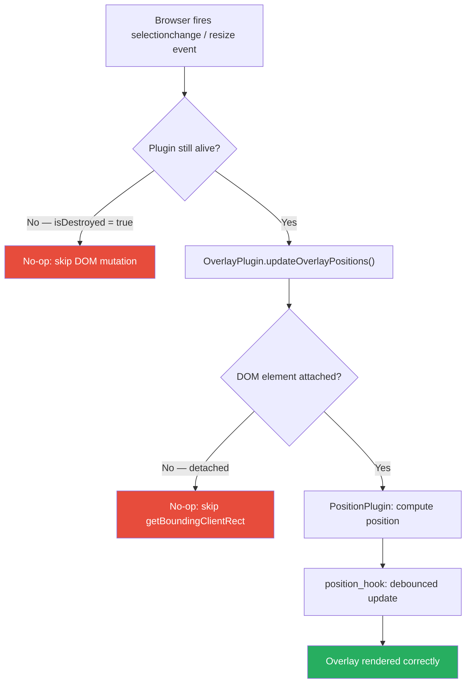
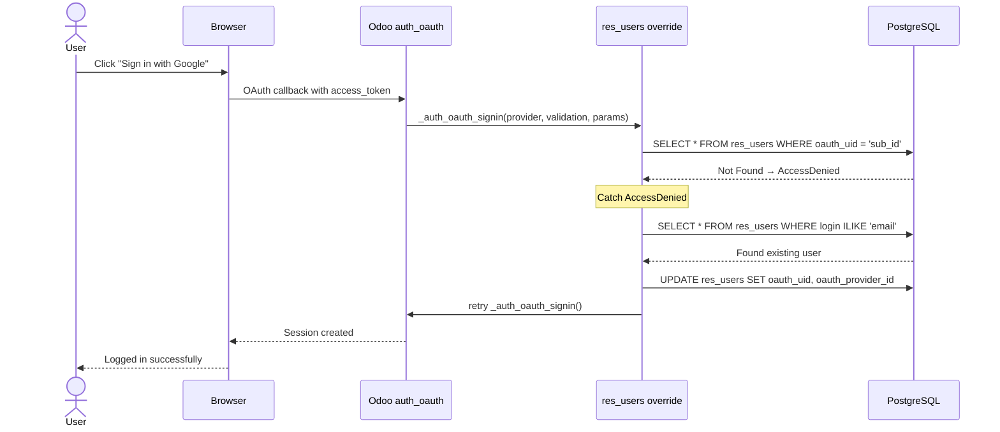

<p align="center">
  
</p>

<h1 align="center">Woow Odoo Core Patch: Browser Enhancement</h1>

<p align="center">
  <strong>Safari HTML Editor Fix + OAuth Email Fallback for Odoo 18</strong><br/>
  Production patches that eliminate Safari crashes and smooth OAuth onboarding for existing users.
</p>

<p align="center">
  <a href="#overview">Overview</a> &bull;
  <a href="#features">Features</a> &bull;
  <a href="#architecture">Architecture</a> &bull;
  <a href="#screenshots">Screenshots</a> &bull;
  <a href="#installation">Installation</a> &bull;
  <a href="#configuration">Configuration</a> &bull;
  <a href="#changelog">Changelog</a> &bull;
  <a href="README_zh-TW.md">中文文件</a>
</p>

<p align="center">
  
  
  
  
</p>

---

## Overview

This module bundles **two independent production patches** for Odoo 18 into a single installable addon:

1. **Safari HTML Editor Fix** — Three JavaScript patches that guard Odoo 18's `html_editor` OWL components against race conditions where Safari/WebKit fires DOM events (e.g., `selectionchange`, `resize`) after the editor instance has been destroyed, causing `TypeError: undefined is not an object` crashes.

2. **OAuth Email Fallback** — A Python override of `_auth_oauth_signin` that automatically links pre-existing Odoo user accounts to OAuth providers (Google, Azure AD, etc.) by matching email addresses on first OAuth login. Without this patch, existing users see "Access Denied" because Odoo cannot match the OAuth provider's `sub` ID to any stored `oauth_uid`.

### Why This Module?

| Problem | Without Patch | With Patch |
|---------|---------------|------------|
| Safari HTML editor | Random `TypeError` crashes, especially in incognito mode | Stable editing across all browsers |
| Existing user + first OAuth login | "You do not have access to this database" error | Auto-links account, seamless login |
| Admin overhead for OAuth | Must manually set `oauth_uid` per user | Zero manual intervention needed |

---

## Features

### Safari HTML Editor Fix (3 JS Patches)

- **`overlay_plugin_patch.js`** — Patches `OverlayPlugin.destroy()` to use optional chaining (`?.cancel()`) on `throttledUpdateContainer`, preventing crash when `destroy()` is called before `setup()` completes
- **`position_plugin_patch.js`** — Patches `PositionPlugin.destroy()` to add missing `layoutGeometryChange?.cancel?.()` cleanup, preventing memory leaks from orphaned animation frame callbacks
- **`position_hook_patch.js`** — Documents the recommended fix for `position_hook.js`'s missing `onLayoutGeometryChange?.cancel?.()` cleanup (hook patching is limited in Odoo's module system)

### OAuth Email Fallback (1 Python Override)

- Overrides `res.users._auth_oauth_signin()` in the `auth_oauth` module
- When OAuth `sub` ID lookup fails (`AccessDenied`), falls back to email-based user search
- Automatically writes `oauth_uid` and `oauth_provider_id` to the matched user record
- Logs all auto-link actions at `INFO` level for audit trail
- If no email match is found, falls through to standard signup flow

---

## Architecture

### System Overview

```
┌────────────────────────────────────────────────────────────────────┐
│           Woow Core Patch: Browser Enhancement                     │
├──────────────────────────────┬─────────────────────────────────────┤
│  Feature 1: Safari Fix       │  Feature 2: OAuth Email Fallback   │
│                              │                                     │
│  ┌────────────────────────┐  │  OAuth Provider (Google / Azure)    │
│  │   OverlayPlugin        │  │          │                          │
│  │   + ?.cancel() guard   │  │          ▼                          │
│  └──────────┬─────────────┘  │  auth_oauth controller              │
│             │                │          │                          │
│  ┌──────────▼─────────────┐  │          ▼                          │
│  │   PositionPlugin       │  │  _auth_oauth_signin()               │
│  │   + cleanup cancel()   │  │  ┌──────────────────┐              │
│  └──────────┬─────────────┘  │  │ Search oauth_uid  │              │
│             │                │  └────────┬─────────┘              │
│  ┌──────────▼─────────────┐  │           │ Not Found               │
│  │   position_hook        │  │  ┌────────▼─────────┐              │
│  │   + docs-only patch    │  │  │ Search by email   │              │
│  └────────────────────────┘  │  │ Auto-link oauth   │              │
│                              │  └────────┬─────────┘              │
│  Browsers: Safari, WebKit    │           ▼                         │
│  Result: No more crashes     │  Login success + audit log          │
└──────────────────────────────┴─────────────────────────────────────┘
```

### Safari JS Patch Flow



### OAuth Email Fallback Flow



---

## Module

### odoo_core_patch_browser_enhancement — Core Patch: Browser Enhancement

> Two production patches for Odoo 18: Safari html_editor race condition fix and OAuth email-fallback signin.

- **Safari HTML Editor Fix** — three JS patches that guard async callbacks in `OverlayPlugin`, `PositionPlugin`, and `position_hook` against post-teardown events on WebKit/Safari
- **OAuth Email Fallback** — Python override of `_auth_oauth_signin` that auto-links an existing Odoo user to an OAuth provider by email, eliminating "user not found" errors for pre-existing accounts

**Price:** Free | **Auto-install:** No | **Depends:** auth_oauth, web

---

## Screenshots

### OAuth Login Page

The login page with OAuth provider buttons. Users click "Sign in with Google" to initiate the OAuth flow.

<p align="center">
  
</p>

### Contacts Working After Fix

The contacts form view loads correctly. The OAuth fallback ensures all users can access their data without manual `oauth_uid` configuration.

<p align="center">
  
</p>

### Website Frontend

The WoowTech website with the HTML editor functioning correctly across all browsers including Safari.

<p align="center">
  
</p>

---

## Installation

### Prerequisites

- Odoo 18.0 Community or Enterprise
- Python 3.10+
- `auth_oauth` module installed (for OAuth fallback feature)

### Steps

1. Clone the repository into your Odoo addons directory:

```bash
git clone https://github.com/WOOWTECH/Woow_odoo_core_patch_browser_enhancement.git
cp -r Woow_odoo_core_patch_browser_enhancement/odoo_core_patch_browser_enhancement /path/to/odoo/addons/
```

2. Update the apps list in Odoo:

```
Settings → Apps → Update Apps List
```

3. Search for "Core Patch" and click **Install**.

4. Restart Odoo to ensure JS patches are loaded:

```bash
sudo systemctl restart odoo
```

---

## Configuration

### Safari Fix

No configuration needed. The JS patches are automatically loaded via `web.assets_backend` when the module is installed.

### OAuth Email Fallback

1. Ensure an OAuth provider is configured:
   - **Settings → General Settings → Integrations → OAuth Authentication**
   - Enable **Google OAuth2** (or your preferred provider)
   - Set the **Client ID** from your provider's developer console

2. Set the correct **Authorized redirect URI** in your OAuth provider's console:
   ```
   https://your-domain.com/auth_oauth/signin
   ```

3. Existing users can now click the OAuth sign-in button on the login page. On first login, the module automatically links their account — no admin intervention needed.

### System Parameters (Reverse Proxy)

If Odoo runs behind Nginx / Cloudflare, ensure these are set:

| Parameter | Value | Purpose |
|-----------|-------|---------|
| `web.base.url` | `https://your-domain.com` | Correct redirect URI generation |
| `web.base.url.freeze` | `True` | Prevent cron from overwriting |

**Important:** Odoo 18 requires `proxy_set_header X-Forwarded-Host $host;` in Nginx — without it, `ProxyFix` middleware is never activated and all OAuth redirect URIs use `http://` instead of `https://`.

---

## Security

### OAuth Fallback Safety

- Uses `self.search()` (not raw SQL) — respects Odoo's access control
- Email matching is case-insensitive (`=ilike`) to handle provider variations
- `oauth_uid` is written only once — subsequent logins use the standard flow
- All auto-link actions are logged at `INFO` level for audit:
  ```
  OAuth: linked existing user user@example.com to provider 3 (uid=1145081289...)
  ```

### JS Patches Safety

- Patches use Odoo's official `@web/core/utils/patch` API
- No monkey-patching or prototype pollution
- Guards are purely defensive (null checks, optional chaining) — they only skip operations, never modify data

---

## Changelog

### v1.1.0 (2026-06-29)

- Added OAuth Email Fallback: auto-link existing users to OAuth providers on first login
- Module renamed from "Browser Enhancement" to "Browser Enhancement + OAuth Fallback"

### v1.0.0 (2026-06-25)

- Initial release: Safari HTML editor race condition fix
- Three JS patches for `OverlayPlugin`, `PositionPlugin`, and `position_hook`
- Eliminates `TypeError: undefined is not an object (evaluating 'this.throttledUpdateContainer.cancel')` on Safari/WebKit

---

## Support

- **Issues:** [GitHub Issues](https://github.com/WOOWTECH/Woow_odoo_core_patch_browser_enhancement/issues)
- **Website:** [woowtech.io](https://woowtech.io)
- **Email:** woowtech@designsmart.com.tw

---

## License

This module is licensed under the [LGPL-3](https://www.gnu.org/licenses/lgpl-3.0.html).

<p align="center">
  <sub>Built with care by <a href="https://woowtech.io">WoowTech</a> for the Odoo community.</sub>
</p>
