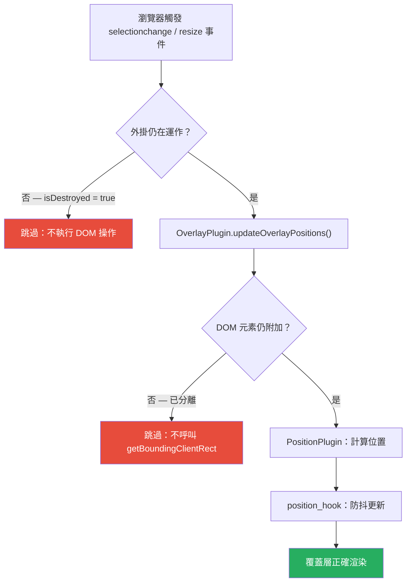
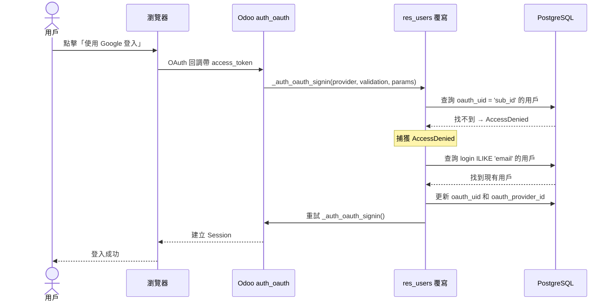
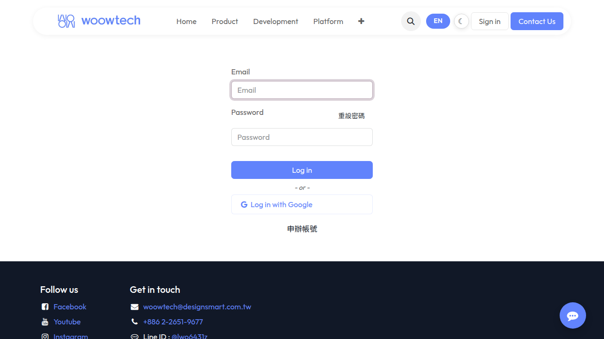
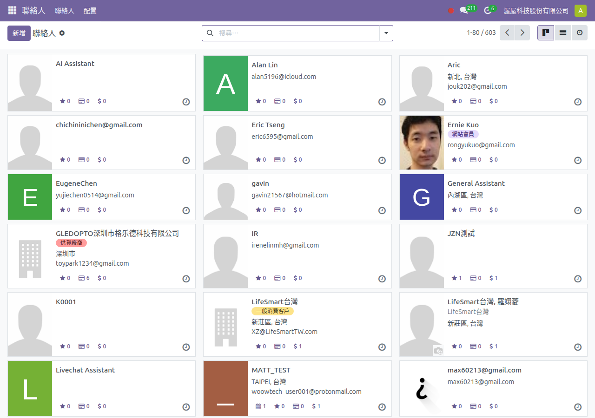
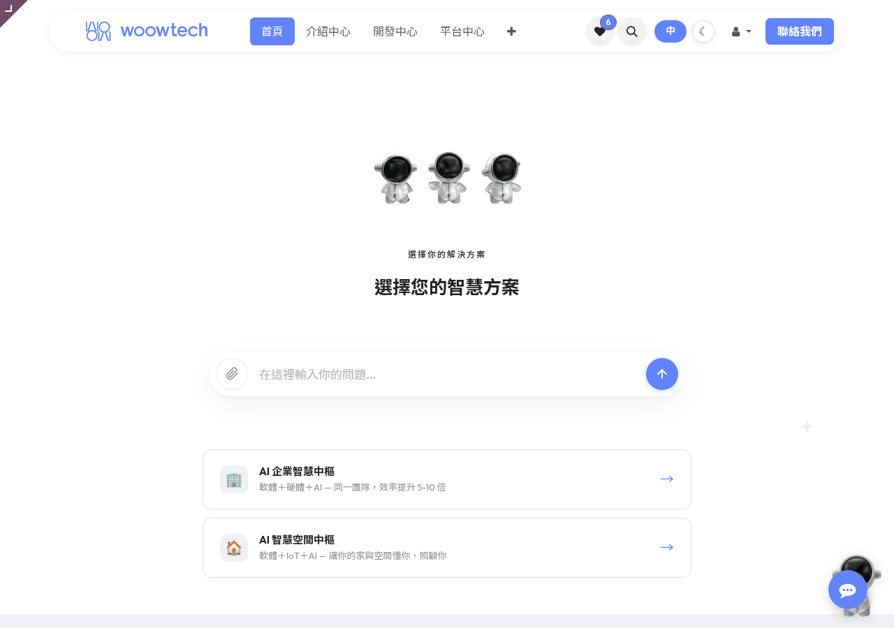

<p align="center">
  
</p>

<h1 align="center">Woow Odoo 核心修補：瀏覽器增強</h1>

<p align="center">
  <strong>Safari HTML 編輯器修復 + OAuth 郵件備援登入（Odoo 18 適用）</strong><br/>
  解決 Safari 編輯器崩潰問題，並為現有用戶提供順暢的 OAuth 登入體驗。
</p>

<p align="center">
  <a href="#總覽">總覽</a> &bull;
  <a href="#功能特色">功能特色</a> &bull;
  <a href="#系統架構">系統架構</a> &bull;
  <a href="#截圖說明">截圖說明</a> &bull;
  <a href="#安裝說明">安裝說明</a> &bull;
  <a href="#設定說明">設定說明</a> &bull;
  <a href="#更新記錄">更新記錄</a> &bull;
  <a href="README.md">English</a>
</p>

<p align="center">
  
  
  
  
</p>

---

## 總覽

本模組將 **兩個獨立的正式修補** 打包成一個可安裝的 Odoo 18 附加模組：

1. **Safari HTML 編輯器修復** — 三個 JavaScript 修補，防止 Odoo 18 的 `html_editor` OWL 元件在 Safari/WebKit 上因競態條件（race condition）而崩潰。Safari 有時會在編輯器元件銷毀後仍觸發 DOM 事件（如 `selectionchange`、`resize`），導致 `TypeError: undefined is not an object` 錯誤。

2. **OAuth 郵件備援登入** — 覆寫 `_auth_oauth_signin` 方法，讓已存在的 Odoo 用戶帳號在首次使用 OAuth（Google、Azure AD 等）登入時，自動透過 Email 地址匹配並綁定 OAuth 提供商。原本 Odoo 會因為找不到對應的 `oauth_uid`（Google 的 `sub` ID）而顯示「您無權存取此資料庫」錯誤。

### 為何需要此模組？

| 問題 | 無修補 | 有修補 |
|------|--------|--------|
| Safari HTML 編輯器 | 隨機 `TypeError` 崩潰，無痕模式尤其明顯 | 所有瀏覽器穩定編輯 |
| 現有用戶首次 OAuth 登入 | 「您無權存取此資料庫」錯誤 | 自動綁定帳號，無縫登入 |
| 管理員 OAuth 設定負擔 | 需為每位用戶手動設定 `oauth_uid` | 零人工干預，自動完成 |

---

## 功能特色

### Safari HTML 編輯器修復（3 個 JS 修補）

- **`overlay_plugin_patch.js`** — 修補 `OverlayPlugin.destroy()` 方法，使用可選串連（`?.cancel()`）存取 `throttledUpdateContainer`，防止 `destroy()` 在 `setup()` 完成前被呼叫時崩潰
- **`position_plugin_patch.js`** — 修補 `PositionPlugin.destroy()` 方法，補上缺失的 `layoutGeometryChange?.cancel?.()` 清理，防止動畫幀回調造成記憶體洩漏
- **`position_hook_patch.js`** — 記錄 `position_hook.js` 中缺失的 `onLayoutGeometryChange?.cancel?.()` 清理建議修復方式（Odoo 模組系統限制 hook 修補能力）

### OAuth 郵件備援登入（1 個 Python 覆寫）

- 覆寫 `auth_oauth` 模組的 `res.users._auth_oauth_signin()` 方法
- 當 OAuth `sub` ID 查找失敗（`AccessDenied`）時，改用 Email 搜尋用戶
- 自動將 `oauth_uid` 和 `oauth_provider_id` 寫入匹配的用戶記錄
- 所有自動綁定操作記錄在 `INFO` 級別日誌，方便稽核追蹤
- 若無 Email 匹配，則回到標準註冊流程

---

## 系統架構

### 系統總覽

```
┌────────────────────────────────────────────────────────────────────┐
│          Woow 核心修補：瀏覽器增強                                  │
├──────────────────────────────┬─────────────────────────────────────┤
│  功能一：Safari 修復          │  功能二：OAuth 郵件備援登入          │
│                              │                                     │
│  ┌────────────────────────┐  │  OAuth 提供商（Google / Azure）      │
│  │   OverlayPlugin        │  │          │                          │
│  │   + ?.cancel() 防護    │  │          ▼                          │
│  └──────────┬─────────────┘  │  auth_oauth 控制器                   │
│             │                │          │                          │
│  ┌──────────▼─────────────┐  │          ▼                          │
│  │   PositionPlugin       │  │  _auth_oauth_signin()               │
│  │   + 清理 cancel()      │  │  ┌──────────────────┐              │
│  └──────────┬─────────────┘  │  │ 搜尋 oauth_uid    │              │
│             │                │  └────────┬─────────┘              │
│  ┌──────────▼─────────────┐  │           │ 找不到                   │
│  │   position_hook        │  │  ┌────────▼─────────┐              │
│  │   + 文件修補建議        │  │  │ 用 Email 搜尋     │              │
│  └────────────────────────┘  │  │ 自動綁定 OAuth     │              │
│                              │  └────────┬─────────┘              │
│  瀏覽器：Safari、WebKit      │           ▼                         │
│  結果：不再崩潰               │  登入成功 + 稽核日誌                 │
└──────────────────────────────┴─────────────────────────────────────┘
```

### Safari JS 修補流程



### OAuth 郵件備援登入流程



---

## 模組

### odoo_core_patch_browser_enhancement — 核心修補：瀏覽器增強

> Odoo 18 的兩個正式修補：Safari html_editor 競態條件修復 + OAuth 郵件備援登入。

- **Safari HTML 編輯器修復** — 三個 JS 修補防止 `OverlayPlugin`、`PositionPlugin` 和 `position_hook` 在 WebKit/Safari 上因非同步回調在元件銷毀後觸發而崩潰
- **OAuth 郵件備援登入** — 覆寫 `_auth_oauth_signin` 方法，透過 Email 自動將現有 Odoo 用戶連結到 OAuth 提供商，消除「用戶未找到」錯誤

**價格：** 免費 | **自動安裝：** 否 | **相依模組：** auth_oauth, web

---

## 截圖說明

### OAuth 登入頁面

帶有 OAuth 提供商按鈕的登入頁面。用戶點擊「使用 Google 登入」即可啟動 OAuth 流程。

<p align="center">
  
</p>

### 聯絡人頁面正常運作

聯絡人表單檢視正確載入。OAuth 備援確保所有用戶無需手動設定 `oauth_uid` 即可存取其資料。

<p align="center">
  
</p>

### 網站前台

WoowTech 網站的 HTML 編輯器在包括 Safari 在內的所有瀏覽器上均正常運作。

<p align="center">
  
</p>

---

## 安裝說明

### 前置條件

- Odoo 18.0 社區版或企業版
- Python 3.10+
- 已安裝 `auth_oauth` 模組（OAuth 備援功能需要）

### 安裝步驟

1. 將倉庫 clone 到 Odoo 附加模組目錄：

```bash
git clone https://github.com/WOOWTECH/Woow_odoo_core_patch_browser_enhancement.git
cp -r Woow_odoo_core_patch_browser_enhancement/odoo_core_patch_browser_enhancement /path/to/odoo/addons/
```

2. 在 Odoo 中更新應用程式列表：

```
設定 → 應用程式 → 更新應用程式列表
```

3. 搜尋「Core Patch」並點擊 **安裝**。

4. 重新啟動 Odoo 確保 JS 修補載入：

```bash
sudo systemctl restart odoo
```

---

## 設定說明

### Safari 修復

無需設定。JS 修補在模組安裝後自動透過 `web.assets_backend` 載入。

### OAuth 郵件備援登入

1. 確認已設定 OAuth 提供商：
   - **設定 → 一般設定 → 整合 → OAuth 驗證**
   - 啟用 **Google OAuth2**（或您偏好的提供商）
   - 設定來自提供商開發者主控台的 **Client ID**

2. 在 OAuth 提供商主控台設定正確的**授權重導向 URI**：
   ```
   https://your-domain.com/auth_oauth/signin
   ```

3. 現有用戶現在可以直接點擊登入頁面上的 OAuth 按鈕。首次登入時，模組會自動綁定帳號——無需管理員介入。

### 系統參數（反向代理）

若 Odoo 執行在 Nginx / Cloudflare 後方，請確認以下設定：

| 參數 | 值 | 用途 |
|------|-----|------|
| `web.base.url` | `https://your-domain.com` | 正確的重導向 URI 產生 |
| `web.base.url.freeze` | `True` | 防止排程自動覆蓋 |

**重要：** Odoo 18 需要 Nginx 設定 `proxy_set_header X-Forwarded-Host $host;`——缺少此標頭，`ProxyFix` 中介軟體不會啟動，所有 OAuth 重導向 URI 會使用 `http://` 而非 `https://`。

---

## 安全機制

### OAuth 備援安全性

- 使用 `self.search()`（非原始 SQL）——遵守 Odoo 存取控制
- Email 匹配不區分大小寫（`=ilike`），處理提供商的大小寫差異
- `oauth_uid` 只寫入一次——後續登入使用標準流程
- 所有自動綁定操作記錄在 `INFO` 級別日誌：
  ```
  OAuth: linked existing user user@example.com to provider 3 (uid=1145081289...)
  ```

### JS 修補安全性

- 使用 Odoo 官方的 `@web/core/utils/patch` API
- 無 monkey-patching 或原型污染
- 防護措施純粹為防禦性（空值檢查、可選串連）——只跳過操作，不修改資料

---

## 更新記錄

### v1.1.0 (2026-06-29)

- 新增 OAuth 郵件備援登入：首次登入時自動將現有用戶連結到 OAuth 提供商
- 模組名稱從「瀏覽器增強」更新為「瀏覽器增強 + OAuth 備援」

### v1.0.0 (2026-06-25)

- 首次發布：Safari HTML 編輯器競態條件修復
- 三個 JS 修補：`OverlayPlugin`、`PositionPlugin`、`position_hook`
- 消除 Safari/WebKit 上的 `TypeError: undefined is not an object (evaluating 'this.throttledUpdateContainer.cancel')` 錯誤

---

## 技術支援

- **問題回報：** [GitHub Issues](https://github.com/WOOWTECH/Woow_odoo_core_patch_browser_enhancement/issues)
- **官方網站：** [woowtech.io](https://woowtech.io)
- **電子郵件：** woowtech@designsmart.com.tw

---

## 授權條款

本模組採用 [LGPL-3](https://www.gnu.org/licenses/lgpl-3.0.html) 授權。

<p align="center">
  <sub>由 <a href="https://woowtech.io">渥屋科技 WoowTech</a> 用心打造，獻給 Odoo 社群。</sub>
</p>
